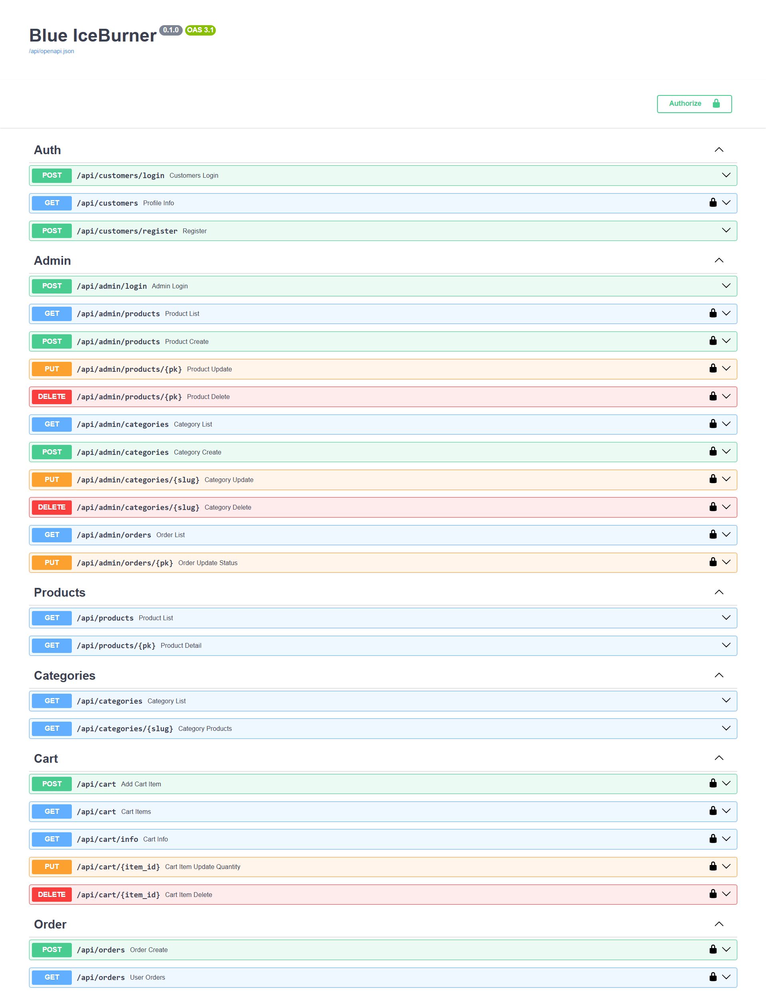

# 🛒 Django Ninja E-commerce API

A full-featured E-commerce backend built with **Django**, **Django Ninja**, and **Django Ninja Extra**. This project includes support for product categories, product colors, cart and cart items, orders and order items, all tied to Django's default user model. A powerful **Admin API** is also included for managing products and orders.

---

## 🚀 Features

- **Products**: Manage products with categories and colors.
- **Cart**: Add/remove items with quantity control.
- **Orders**: Full order management system.
- **Admin API**: Create and manage products, categories, and orders.
- **Swagger Documentation**: Auto-generated API docs using Django Ninja.

---

## 🧪 API Documentation

Interactive API documentation is available via **Swagger UI**.



---

## 📦 Installation

### Prerequisites

Make sure you have **Python 3.10+** installed. Then, install [`uv`](https://github.com/astral-sh/uv):

```bash
curl -Ls https://astral.sh/uv/install.sh | sh
```

### Setup Project

1. Clone the repository:

```bash
git clone https://github.com/AminZahedSadeghi/dana-cup.git
cd dana-cup
```

2. Initialize the project environment:

```bash
uv init
```

3. Install dependencies:

```bash
uv sync
```

4. Run migrations and start the development server:

```bash
python manage.py migrate
python manage.py runserver
```

---

## 👤 Default User System

This project uses Django's built-in authentication system. You can register and log in using the standard endpoints or create superusers via:

```bash
python manage.py createsuperuser
```

---

## 🛠 Project Structure

- `products/`: App for product, category, and color models.
- `orders/`: Order and order item logic.
- `cart/`: Cart and cart item features.
- `api/`: All API routers including admin and public routes.

---

## 🧑‍💻 Contributing

Feel free to fork the project, make changes, and create a pull request.

---

## 📝 License

MIT License. See `LICENSE` file for details.